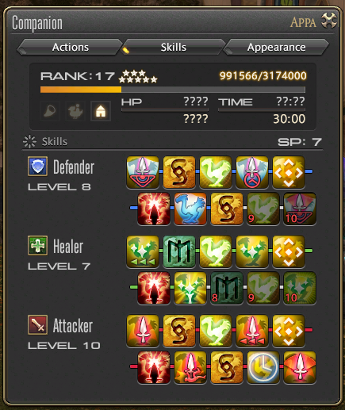

### When do I get my Chocobo?

To earn a mount, you need to have completed the level 20 main story quest and joined a grand company. You will be able to start a side quest called "My Little Chocobo" at the Grand Company HQ.

The Grand Company's Quartermaster will sell a Chocobo Issuance for 2,000 company seals. Company seals can be earned by participating in FATEs, or by doing Grand Company Levequests.

At level 20 and 25, Grand Company Levequests are available from Eugene in Moraby Drydocks (Limsa Lominsa), Cedrepierre in Hawthorne Hut (Gridania) and Kikiri in Camp Drybone (Ul'dah).

### How can I summon my chocobo to fight?

There is also a follow-up quest available from level 30 which allows you to summon your chocobo to fight with you in battle. The quest is [My Feisty Little Chocobo] and starts in Camp Tranquil.

As your chocobo ranks up, you will earn Skill Points which can be spent to teach your chocobo abilities to become either a Tank, DPS or Healer.

Your chocobo can rank up to level 20, but for each rank from rank 10 and above it will require the use of a [Thavnarian Onion](http://ffxiv.gamerescape.com/wiki/Thavnairian_Onion) to raise the rank cap each rank.

If you are a member of a free company with a house, you can stable your chocobo at the guild hall's Chocobo Stables in the garden (if they have one). This allows you to feed your chocobo [Krakka Roots](http://ffxiv.gamerescape.com/wiki/Krakka_Root) which grant 1% of the max xp for the rank. This also allows you to feed other chocobos and for others to feed yours. You cannot summon your chocobo to fight while it is stabled.
