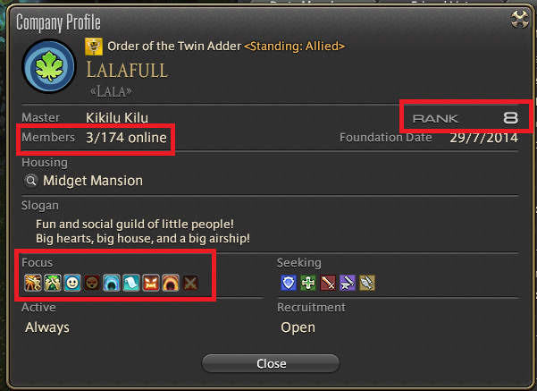

### How do I choose a guild to join?

There are hundreds of player-run guilds on each world, but you can only join one at a time. You will probably encounter your first guilds in shouted advertisements in towns, in the party finder, or maybe even in direct messages and invitations.

Being in a guild can be very beneficial, but you should make sure you are getting something out of it too. You can view Company Profiles when searching for people in the social menu, or in linkshell windows.

On the guild window, you should look at a few pieces of information

- How big is the guild, and how many people are online now?
- What is the guild focus? Is it more social or hardcore raiding?
- What rank is the guild? Guilds lower than rank 8 will still be trying to unlock bonuses including exp buffs and housing.

You should also make sure to chat to someone in the guild before joining. If you received an invitation to a guild without anybody saying anything to you first, it may not be a very social guild.

While larger guilds can afford to have exp increasing buffs on at all times, some guilds are too small to be able to afford these. When choosing a guild, you may want to ask how often they have their company buffs on.

### Founding a guild

Don't like any of the guilds you see? Why not create your own?

If you want to create your own guild, you must be a member of a Grand Company, level 25 and have been guildless for at least 24 hours prior to founding.

To found the guild, speak to an OIC Administrator in any of the Grand Company Headquarters. After filling in some basic details, you'll need to get 3 other players to sign the petition to found your guild and become the first members. You can do this by right-clicking them and selecting "Invite to Free Company".

Once you have all the signatures you need, you need to take the petition back to the OIC Administrator and pay 15,000 gil to found your guild.

### What alternatives are there?

If the idea of joining a single guild doesn't appeal to you, you can join up to 8 linkshells. These are effectively chat rooms which you can join and chat in, regardless of whether you are in a guild or not. They are often more populated than the guilds so can offer some great social interactions, news, and invitations to events.