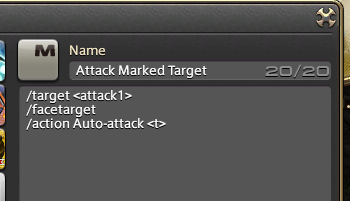
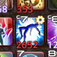

### What are macros?

Macros are a way of executing a set of actions in order by pressing a single button.

To see and write macros, open up the /macros menu or press the "System" menu option and select "User Macros"



Macros allow you to write up to 15 lines of commands and include anything you could normally use in the chat box.

The most common macro you will want to use it to execute an ability. To do this you would type something like the following;

/action "Ability name" <t>

This would execute the ability "Ability name" on the current target.

E.g.

```/action "Cure" <t>```

You can also execute abilities on yourself with <me>

```/ac "Divine Seal" <me>```

If you want to add a wait after an action before the next one is executed, you use <wait.x> where 'x' is the number of secondsd to wait before the next ability.

E.g.

```/ac "Divine Seal" <me> <wait.2>
/ac "Cure" <t>```

This would activate Divine Seal on yourself, then start casting Cure on the target 2 seconds later.

You can change the icon of the macro to the icon an ability would normally use with something like the following

```/macroicon "Raise"
/party Raising <t>
/action "Swiftcast" <me> <wait.1>
/action "Raise" <t>```

This tells everyone in the party chat who you're raising, before using Swiftcast followed by Raise. The icon for the whole ability would be the Raise icon, including the mp cost and whether or not the target is in range. The only difference between this and the normal ability is the cog at the top-right showing its a macro.



To use your macro, you can either right-click and Execute in the macro menu, or you can drag it onto your hotbar and use it like a normal ability.
