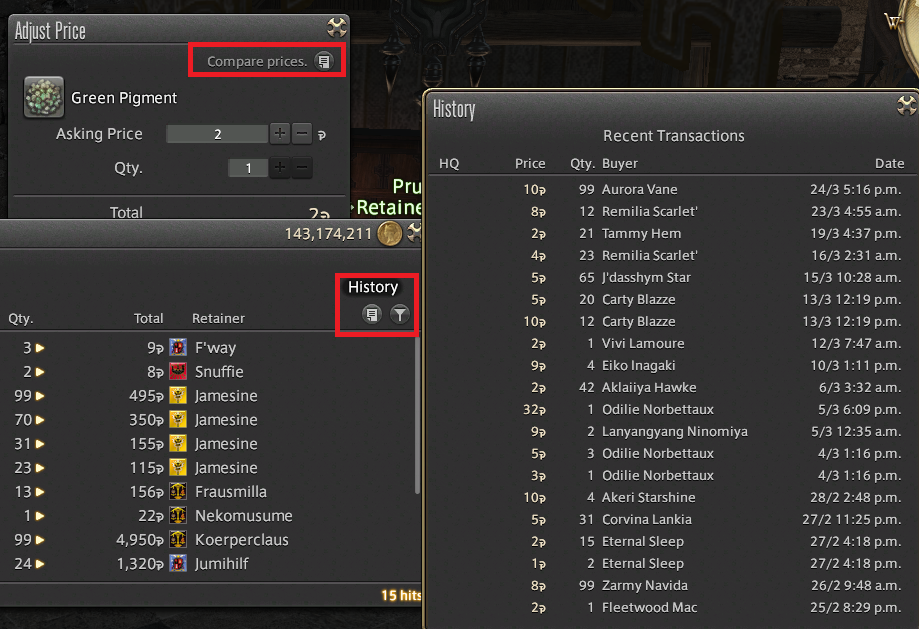
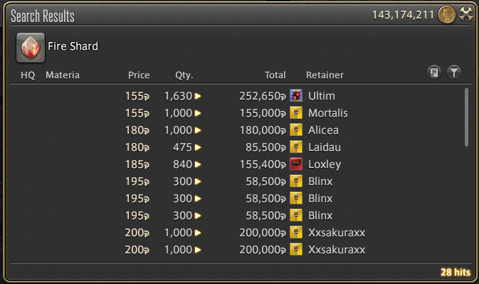
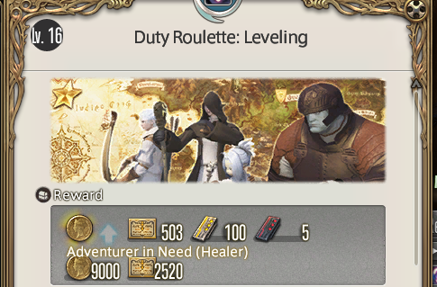

### How do I earn money?

### Selling with retainers

After unlocking retainers, you can use them to sell items on the market board. When deciding what price to sell things at, be sure to check the history of sales as well as the prices and quantities other people are selling at.

For example, if all of the items currently on sale are in stacks of 1-5 items, it may be hard to sell your items if you put up a stack of 99 without splitting them up.

Consumable items can be very profitable, as they will always be needed. Elemental shards are a great starting item to sell, as these are available to level 1 miners and botanists, and are used in a lot of crafts.

### Loot the dungeon

Raiding dungeons can earn you money directly in small amounts, but can also earn you gear and items which can be sold. For items you can't sell (such as those with a green or purple background), you can trade them in to your Grand Company's Personnel Officer through "Expert Delivery" after earning the rank of "Sergeant Second Class" for company seals.

Company seals can be traded in to your Grand Company's Quartermaster for [Ventures](http://ffxiv.gamerescape.com/wiki/Venture). These tokens can be given to retainers to send them on short quests for more items. This can either be a specific item from a shortlist and a 1 hour expedition, or a random item from a longer 18 hour expedition. The items they bring back are almost always sellable, and some of the items can be worth a lot of money.

Your retainers only have a limited number of spaces available to sell items, and not everything is worth selling on the market board. For items which are not worth very much, you should sell them on the market board.

Finally, you can earn gil bonuses from doing quests, completing challenges from your **/challengelog**, and using the duty roulettes, especially if using a class listed by the "Adventurer in need" bonus.

