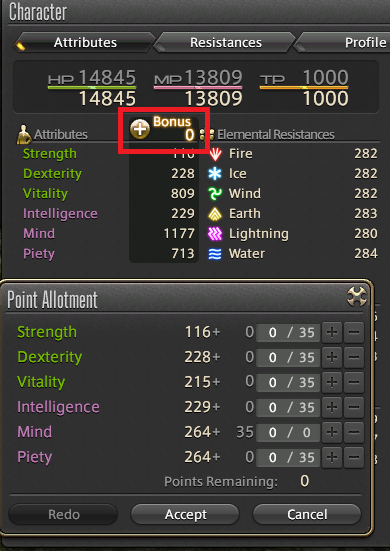
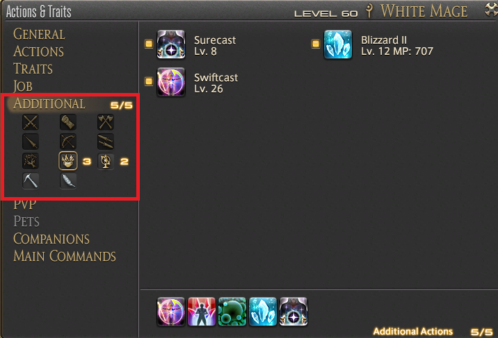

# What can I do to be better at my job?

First, do your class/job quests. These can be found at your class' guild and will sometimes give you new abilities.

As you level up, you earn Bonus attributes which you can spend. These are available on your character page.
- In general, Tanks want Vitality, Melee wants Strength, Ranged physical attackers want Dexterity, Ranged magic attackers want Intelligence, Healers want Mind. 
- Ninjas and Rogues benefit more from Dexterity than Strength.

You can use some abilities from other classes you have leveled under the "Additional" section of "Actions & Traits". Important abilities include:
- Swiftcast (THM 26) for mages, allowing instant cast of the next spell.
- Flash (GLA 08) + Provoke (GLA 22) for tanks, both useful taunts.
- Invigorate (LNC 22) for physical dps instantly restores TP.
- Stoneskin (CNJ 34) adds a barrier which absorbs damage on a target.
- Blood for Blood (LNC 34) gives a damage increase for physical dps while increasing damage taken.
- Internal Release (PGL 12) for physical dps increases critical hit rate.

